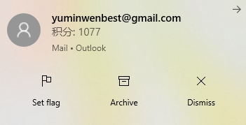

# 1p3a_auto_sign
一亩三分地自动签到脚本/ 1point3acres.com forum auto sign script (still working)

What you need: Python3 + Selenium + raspberry pi 4 / Linux

What it can do for you: auto sign for you once a day to get forum point, and send your current points to your email, 
so you would know your total wealth. :dog:

This script also saves the screenshot of the forum news for you. You can find it under the same folder. 

Steps:

0. Pip3 install selenium, fake_useragent

1. Install chrome and chromedriver
If you are using raspberry pi 4, the default chromium browser is fine. we just need to download armhf version of chromedriver.

  https://launchpad.net/ubuntu/xenial/armhf/chromium-chromedriver/78.0.3904.108-0ubuntu0.16.04.1

  If you use x86, find the related chromedriver.

2. git pull or download the python file to your desired folder

3. In the same folder, create accounts.json
Fill in your account and password for 1point3acres.com
{
	"account": "",
	"password": ""
}

4. In the same folder, create emails.json
Fill in your account and password for Gmail, and the email address that you want to receive the notification
{
	"senderGmailAccount": "***@gmail.com",
	"senderGmailPass": "",
	"receiver": "***@***.com"
}

5. Open your linux terminal, run "python3 1p3a.py". Test If you receive the email about your forum points.

6. Add "python3 1p3a.py" to your crontab. Make it run once a day. 
