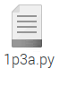
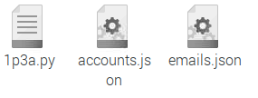
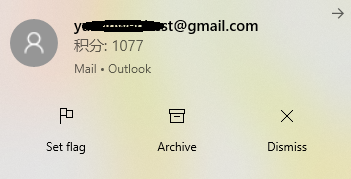
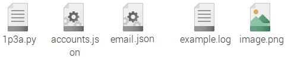

# 1p3a_auto_sign / 一亩三分地自动签到脚本
1point3acres.com forum auto sign script

## What you need: 
* Python3
* Chrome && chromedriver
* Selenium
* Linux (Use raspberry pi 4 for demo)

## What it can do for you: 
Auto sign for you once a day to get forum point, and send the result to your email, 
so you would know your total wealth :dog:

This script also saves the screenshot of the forum news for you. You can find it under the same folder. 

## Steps:
1. Install Python3 (3.7+) to your Linux
2. Install selenium, fake_useragent
```python
pip3 install selenium
pip3 install fake_useragent
```
3. Install chrome and chromedriver
* If you are using raspberry pi 4, the default chromium browser is fine. We just need to download [armhf version of chromedriver](https://launchpad.net/ubuntu/xenial/armhf/chromium-chromedriver/78.0.3904.108-0ubuntu0.16.04.1)
* If you are using x86 Linux, first download [chrome browser](https://www.google.com/chrome/), second find the related [x86 chromedriver](https://chromedriver.chromium.org/downloads)
4. Download the project
```
git clone https://github.com/minweny/1p3a_auto_sign.git
```
Your folder starts with one python file
<br><br>
5. In the same folder, create accounts.json
Fill in your 1point3acres.com account and password
```json
{
	"account": "",
	"password": ""
}
```
6. In the same folder, create emails.json
Fill in your account and password for Gmail, and the email address that you want to receive the notification.
<br>Note: You may need to disable some security settings in Gmail
```json
{
	"senderGmailAccount": "***@gmail.com",
	"senderGmailPass": "",
	"receiver": "***@***.com"
}
```
After step 5 and 6, you would have:
<br><br>
7. Open your linux terminal, run the python script. 
```
python3 1p3a.py
```
Test If you have received the email about your forum points.
<br><br>
8. Add "python3 1p3a.py" to your crontab. Make it run once a day or more.
<br>Open bash terminal
```
crontab -e
```
Add following setences
```
# execute the python script every 6 hours
* */6 * * * /usr/bin/python3 /home/pi/1p3a.py
```
## Logging and screenshot
You would find example.log and image.png under your current folder
<br><br>
